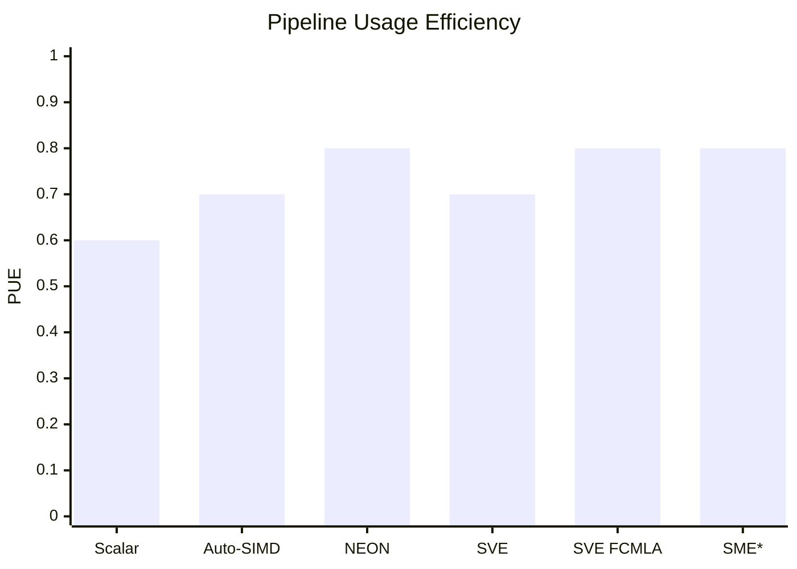
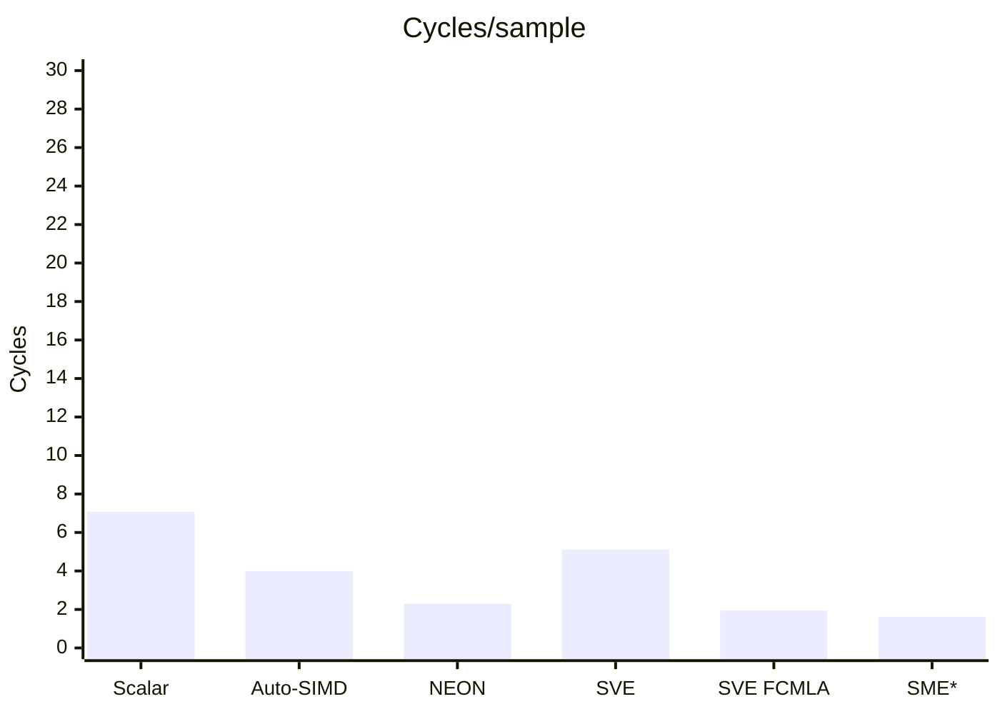

# ARM Pipeline Exploration on Toy Example

Consider different ARM implementations of a 4-Rx Maximum Ratio Combining (MRC) on the CPU pipeline. Call it a kernel.

Consider Neoverse V2, modern ARMv9 core.

Consider Godbolt framework for fast prototyping. See [▶ Open the MRC benchmark in Compiler Explorer](https://godbolt.org/z/3KaaP9rKE)

Consider compilation target: AArch64 / Armv8-A.  

Consider uarchitecture model Arm Neoverse V2.

Consider compiler: Clang 23.1 (most recent available) and `-O3` optimization level, unless specified otherwise.

The present goal is to provide a genuine benchmark of the MRC implementation over the ARM uarchitecture extensions. Focus in particular on the SIMD, NEON, SVE, SME extensions.

For benchmarking purpose, consider LLVM-MCA after isolation of the relevant piece of code. Based on that, produce some top level metrics for benchmarking purpose.

## Kernel

For each complex input sample:

$$
y[k] = \sum_{a=0}^{3} \mathrm{conj}(h_a[k]) \cdot r_a[k]
$$

This is typical usecase for LTE-A MIMO receiver. This operation is performed for each RE, that could be (20MHz, FDD Transmission Scheme), 14 OFDM symbols, 1200 subcarriers per subframe (1ms), thus 16,800 MRC per ms, ~17e6 MRC per second. Definitely a candidate for massively repeated execution on a DSP.

## Methodology and Increments

To make LLVM-MCA results comparable, each benchmark processes exactly 4 complex output samples.

LLVM-MCA regions isolate the kernel:

```cpp
asm volatile("# LLVM-MCA-BEGIN mrc4_block");

// kernel

asm volatile("# LLVM-MCA-END mrc4_block");
```

Consider for reference the build arguments:

Naive Implementation aka Scalar
```text
-O3 -std=c++17 -mcpu=neoverse-v2 -fno-vectorize -fno-slp-vectorize

```

SIMD (automatically enabled by compiler)
```text
-O3 -std=c++17 -mcpu=neoverse-v2

```

Explicit NEON
```text
-O3 -std=c++17 -mcpu=neoverse-v2

```

SVE
```text
-O3 -std=c++17 -mcpu=neoverse-v2 -msve-vector-bits=128

```

SVE (FCMLA)
```text
-O3 -std=c++17 -mcpu=neoverse-v2 -msve-vector-bits=128

```

SME
```text
-O3 -std=c++17 -mcpu=neoverse-v2+sme

```

Special case for LLVM-MCA arguments:
SME
```text
-mcpu=neoverse-v2 -mattr=+sme -timeline

```

### SIMD in a Nutshell

A first attempt was made leaving the complete variable-size MRC loop. However, the compiler-generated code contained both a vectorized main loop and a scalar remainder loop. Then LLVM-MCA analyzed both paths as part of the same code region. This made direct comparison misleading: the reported instruction count, total cycles and block throughput did not represent the same amount of useful work between the scalar and SIMD implementations. The benchmark was therefore reduced to a fixed block of 4 complex samples to match the width of a 128-bit NEON vector (`4 × float32`).

### NEON in a Nutshell

NEON is a fixed-width SIMD architecture. In AArch64, a 128-bit NEON vector can process 4 `float32` values in parallel.

In this benchmark, explicit NEON vectorizes the MRC arithmetic and uses structured loads and stores (`LD2`/`ST2`) to efficiently handle the interleaved real/imaginary complex representation.

### SVE in a Nutshell

FMA (Fused Multiply-Add) computes a multiplication and an addition as a single operation: $a = a + b \times c$. It reduces the number of instructions and performs only one floating-point rounding for the combined operation.

FCMLA (Floating-point Complex Multiply-Add) performs a multiply-accumulate directly on complex values represented as interleaved real and imaginary components: $a = a + b \times c$, where `a`, `b` and `c` contain complex values.

SVE extends SIMD with a vector-length-agnostic programming model and predicated execution. The first SVE implementation (v4) separates real and imaginary components using gather/scatter operations. This demonstrates that using a more capable SIMD ISA does not automatically produce a better implementation when the data layout is poorly matched to the instructions.

V4.1 uses FCMLA to keep the complex samples in their native representation, avoiding the gather/scatter decomposition of v4. The improvement therefore comes from a better mapping of the algorithm onto the ISA, rather than from using wider vectors: SVE is restricted to 128 bits in this comparison.

### SME in a Nutshell

SMEextends SVE with streaming execution and matrix-oriented facilities such as the ZA array.

MRC is basically a complex vector operation and does not naturally map onto SME's matrix outer-product operations. v5 therefore evaluates the complex FCMLA implementation in SME streaming mode rather than forcing the
algorithm into a matrix representation.

## Top-level Results

Performance outcome
| Metric | v1 Scalar | v2 Auto-SIMD | v3 NEON | v4 SVE | v4.1 SVE FCMLA | v5 SME* |
|---|---:|---:|---:|---:|---:|---:|
| Instructions / MCA region | 134 | 75 | 26 | 45 | 29 | 37 |
| µOps / MCA region | 170 | 93 | 55 | 123 | 47 | 39 |
| Block Throughput (cycles) | 28.3 | 16.0 | 9.2 | 20.5 | 7.8 | 6.5 |
| Speedup vs Scalar | 1.00× | 1.77× | 3.08× | 1.38× | 3.63× | N/A* |

\* v5 uses a hypothetical Neoverse V2 + SME LLVM-MCA configuration.
The Streaming Vector Length is not established as 128 bits by this experiment, so the MCA region cannot be normalized to exactly four complex samples.
The reported 6.5-cycle Block Throughput is therefore retained as a raw LLVM-MCA result only.

TODO: Provide script for PUE, ED, based on log


## Going More into the Details (Inside the Pipeline)

LLVM-MCA timeline helps in going beyond the above averaged metrics. See v*.log and consider notations:
```text
`D`  Dispatch
`=`  Wait before Execution
`e`  Execution Slot
`E`  Execution Completion
`-`  Wait before Retirement
`R`  Retired
```

As per the timeline view, define the average wait times:
 - [0]: Executions
 - [1]: Average time spent waiting in a scheduler's queue
 - [2]: Average time spent waiting in a scheduler's queue while ready
 - [3]: Average time elapsed from WB until retire stage

Their meaning is described below.

```text
                         Scheduler Queue                    Execution       Retirement
                    <---------------------->               <-------->      <---------->
D  =  =  =  =  =  =  =  =  e  e  e  e  E  -  -  -  -  R
│  <-------- [1] -------->  │          │  <--- [3] --->  │
│                           │          │                 │
│             <--- [2] ---> │          │                 │
│             ready, but    │          │                 │
│             waiting for   │          │                 │
│             a resource    │          │                 │
│                           │          │                 │
Dispatch                 Execute      WB              Retire
```

Basically the most interesting metric is [2] and should be minimized.


Let's build on top some timeline metrics to produce custom descriptive values derived from the LLVM-MCA timeline pipeline. Consider e.g.:
- Cycles per processed sample 
- Pipeline Usage Efficiency (PUE) $[0] / ([0]+[1])$
- Execution Density (ED) $[0] / ([0]+[1]+[3])$

The metrics are produced by `metrics.py` and fed by the logs.

Pipeline outcome
| Metric | v1 Scalar | v2 Auto-SIMD | v3 NEON | v4 SVE | v4.1 SVE FCMLA | v5 SME* |
|---|---:|---:|---:|---:|---:|---:|
| [1] Scheduler wait | 5.1 | 9.3 | 9.6 | 6.6 | 6.3 | 6.7 |
| [2] Ready/resource wait | 0.5 | 1.6 | 0.6 | 1.6 | 0.3 | 0.6 |
| [3] WB → Retire | 4.4 | 6.2 | 5.5 | 5.1 | 6.2 | 8.1 |
| Cycles/sample | 7.08 | 4.00 | 2.30 | 5.12 | 1.95 | 1.62 |
| PUE | 0.6 | 0.7 | 0.8 | 0.7 | 0.8 | 0.8 |
| ED | 3.09 | 2.18 | 1.59 | 0.69 | 1.77 | 3.69 |

Find a top-level evidence of the extensions benefit. PUE states the pipeline efficiency, cycles/sample whether it translates to actual throughput.





### Sparse yet Detailed Pipeline Comparison: Scalar (v1) vs Auto-SIMD (v2)

Interestingly, the auto-vectorized implementation is much faster overall, but shows a higher proportion of pre-execution waiting. That suggests some optimization question.

Highlight some LLVM-MCA timeline for discussion.

#### 1. Loads: same latency, more data

```asm
Scalar                           Auto-SIMD

DeeeeeeER  ldp s1, s2, [x0]      DeeeeeeER  ldp q3, q4, [x0]
```

Yet same execution latency (6 cycles), v2 deals with 128-bit vector registers and therefore moves more data per instruction. Thus increase in parallelism with no significant penalty in instruction latency.

#### 2. Scalar dependency chains

Typical sequence v1:

```asm
D====eeeE...       fmul   s25, s2, s18
D======eeeeE...    fmadd  s25, s17, s1, s25
...
D========eeE...    fadd   s25, s25, s0
D==========eeE...  fadd   s2, s25, s2
```

`=` cycles increases and shows instructions being dispatched but waiting before execution. Successive MAC and ADD operations introduce dependency and clip parallelism.

#### 3. SIMD computation introduces data rearrangement

v2 processes 4 `FLP32` with 1 instruction, 4 bytes each so 16 bytes (128 bits):

```asm
D=====eeE...          trn2  v2.4s, v0.4s, v0.4s
D======eeE...         trn1  v0.4s, v0.4s, v0.4s
...
D===========eeeE...   fmul  v1.4s, ...
D===========eeeeE...  fmla  v1.4s, ...
```

The `.4s` vector operations perform 4 FLP operations in a single operation (parallel), excellent. But see `trn2` / `trn1` that rearrange the interleaved real and imaginary components, this is a penalty induced by SIMD when dealing with `struct Complex { float re;  float im; };`. In memory the array of data is then interleaved `re0 im0 | re1 im1 | ...` and the compiler thinks it is mandatory de-interleave. Well, this could be handled differently to save this cost by preparing the data with proper layout or considering `re` and `im` are independent so their order does not matter. This later aspect is a special case and does not scale up.

#### 4. SIMD does not eliminate dependency chains

Towards the end of V2:

```asm
D============eeeeE-R     fmla  v1.4s, ...
D================eeER    fadd  v0.4s, v0.4s, v1.4s
...
D===========eeeeE--R     fmla  v1.4s, ...
D=================eeER   fadd  v0.4s, v0.4s, v1.4s
D====================eeER stp  q2, q0, [x8]
```

The auto-vectorized implementation performs substantially more useful work per instruction, but long pre-execution waits remain visible.

The final accumulation and store are still constrained by preceding results.

### Sparse yet Detailed Pipeline Comparison: Auto-SIMD (v2) vs NEON (v3)
#### 1. Data rearrangement overhead

```asm
D======eeE----------R     trn2  v1.4s, v17.4s, v17.4s
D=========eeE-------R     trn2  v3.4s, v21.4s, v3.4s
D===========eeeE----R     fmul  v1.4s, v1.4s, v3.4s
D=====eeE----------R      trn1  v3.4s, v17.4s, v17.4s
D===========eeeeE--R      fmla  v1.4s, v21.4s, v3.4s
D=================eeER    fadd  v0.4s, v0.4s, v1.4s
D====================eeER stp   q2, q0, [x8]
```

The compiler successfully vectorizes the computation, but the interleaved complex layout requires several `TRN1` / `TRN2` operations to rearrange real and imaginary components.

These additional instructions consume pipeline resources and introduce dependencies before the useful multiply-accumulate operations.

V3 addresses this explicitly with NEON structured loads and stores (`LD2` / `ST2`), moving the real/imaginary separation to the memory access itself rather than performing it through explicit shuffle instructions.

### Sparse yet Detailed Pipeline Comparison: NEON (v3) vs SVE (v4, v4.1)
#### 1. Scatter Overhead in v4

A representative sequence in v4:

```asm
DeeeeeeeeeE-------R    ld1w  { z5.s }, p0/z, [x12, z0.s, uxtw]
DeE---------------R    add   x12, x12, #4
D==eeeeeeeeeE----R     ld1w  { z6.s }, p0/z, [x12, z0.s, uxtw]
DeE--------------R     add   x12, x2, x9
D=eeeeeeeeeE----R      ld1w  { z7.s }, p0/z, [x12, z0.s, uxtw]
DeE-------------R      add   x12, x12, #4
D====eeeeeeeeeER       ld1w  { z16.s }, p0/z, [x12, z0.s, uxtw]
```

The naive SVE implementation separates real and imaginary components through gather/scatter memory operations.

The long execution periods are clearly visible in the pipeline. In the Neoverse V2 model, each gather load expands to 5 µOps with a latency of 9 cycles, making memory rearrangement substantially more expensive than
the structured `LD2` / `ST2` approach used by v3. This contributes to v4 regressing compared to NEON.

#### 2. Complex-Aware Arithmetic in v4.1

```asm
ldp    q0, q1, [x0]
ldp    q2, q3, [x4]
fcmla  z4.s, p0/m, z3.s, z1.s, #0
fcmla  z5.s, p0/m, z2.s, z0.s, #0
fcmla  z4.s, p0/m, z3.s, z1.s, #270
fcmla  z5.s, p0/m, z2.s, z0.s, #270
```

Instead of separating real and imaginary components, V4.1 keeps complex samples in their native interleaved representation and operates directly on them using pairs of `FCMLA` instructions.

The gather/scatter decomposition disappears, while two independent accumulators expose additional instruction-level parallelism.

With SVE still restricted to 128 bits, Block RThroughput drops. The improvement therefore comes from a better mapping of the algorithm onto the ISA, not actually from wider vectors.

### Sparse yet Detailed Pipeline Comparison: NEON (v3) vs SME (v5)
#### 1. Vector Arithmetic remains the Limiting Structure

A representative sequence in v5:

```asm
DeeeeeeER              ldr    z0, [x0]
DeeeeeeER              ldr    z1, [x4]
D=eeeeeeER             ld1w   { z2.s }, p0/z, [...]
D=eeeeeeER             ld1w   { z3.s }, p0/z, [...]
...
D=====eeeeeE...         fcmla  z5.s, p0/m, z1.s, z0.s, #0
D=====eeeeeE...         fcmla  z4.s, p0/m, z3.s, z2.s, #0
D==========eeeeeE...    fcmla  z5.s, p0/m, z1.s, z0.s, #270
D==========eeeeeE...    fcmla  z4.s, p0/m, z3.s, z2.s, #270
```

SME enables streaming execution, but the MRC kernel remains fundamentally a complex vector operation. The generated code therefore still consists primarily of vector loads followed by `FCMLA` dependency chains.

No ZA matrix or outer-product operation naturally emerges from the algorithm. Unlike the transition from v4 to v4.1, SME therefore does not expose a new algorithmic optimization for this kernel.

The raw modeled looks good, but it is not directly work-normalized against v3 because the SME Streaming Vector Length is not fixed to the same 128-bit workload. The Neoverse V2 + SME configuration is also hypothetical.

## Architecture outcome

| | v1 Scalar | v2 Auto-SIMD | v3 NEON | v4 SVE Auto-FMA | v4.1 SVE FCMLA | v5 SME* |
|---|---|---|---|---|---|---|
| Data parallelism | 1 × FP32 | 4 × FP32 | 4 × FP32 | 4 × FP32 SVE | SVE complex pairs | Streaming SVE complex pairs |
| Arithmetic | Scalar FP | Vector FP | NEON FMA | SVE FMA | SVE `FCMLA` | Streaming `FCMLA` |
| Data access | Scalar loads | Vector loads | `ld2` / `st2` | Gather / scatter | Contiguous vector loads | Streaming vector loads |
| Data rearrangement | Minimal | `trn1` / `trn2` | Structured load/store | Gather / scatter | Native interleaved complex representation | Native interleaved complex representation |
| Main limitation | Scalar execution | Shuffle overhead | FMA dependency chains | Gather/scatter overhead | FCMLA dependency chains | Model / SVL comparability |
| Block RThroughput | 28.3 | 16.0 | 9.2 | 20.5 | 7.8 | 6.5* |
| Cycles / sample | 7.08 | 4.00 | 2.30 | 5.13 | 1.95 | N/A* |
| Relative speedup | 1.00× | 1.77× | 3.08× | 1.38× | 3.63× | N/A* |

\* SME is modeled by enabling SME on the Neoverse V2 LLVM-MCA scheduling model. Since Neoverse V2 does not implement SME, then v5 is a tentative ISA modeling experiment. Direct comparison in the benchmark is slightly speculative.

## Top-Level Outcomes based on the Benchmark

v1:   many scalar operations and dependency chains.

v2:   parallel computation and fewer instructions, but data rearrangement and remaining dependencies.

v3:   explicit NEON removes data rearrangement overhead. Some dependencies remain.

v4:   SVE vectorization, but gather/scatter overhead makes the naive mapping inefficient.

v4.1: complex-aware SVE with FCMLA removes gather/scatter overhead and reduces dependency pressure.

v5:   SME streaming further reduces modeled throughput, but the result is not directly comparable due to streaming vector length and the hypothetical V2+SME model.