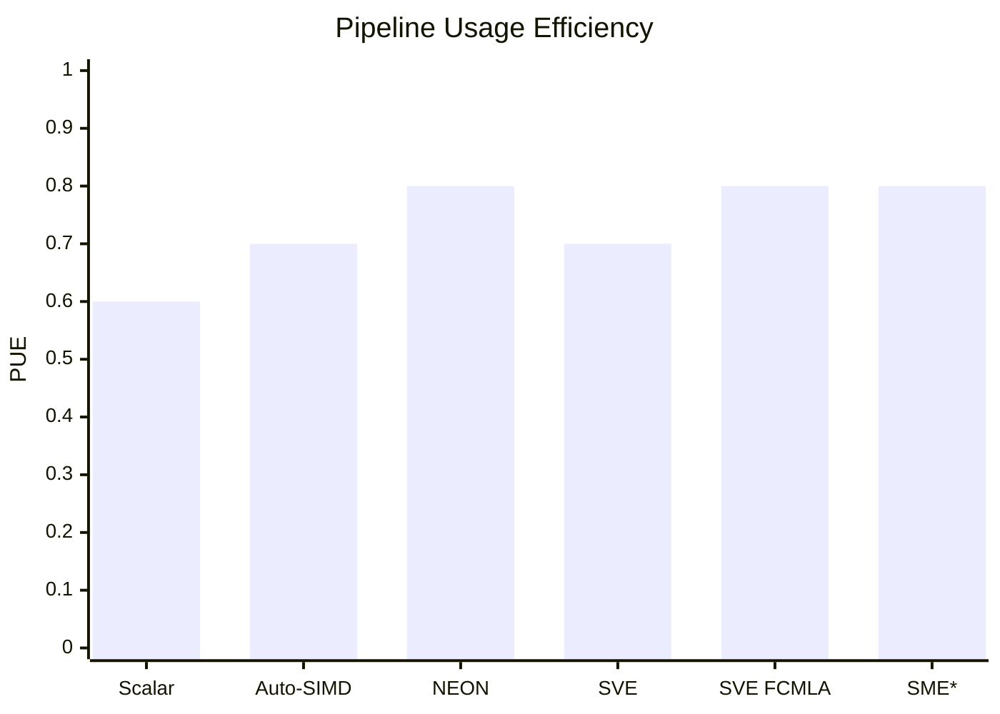
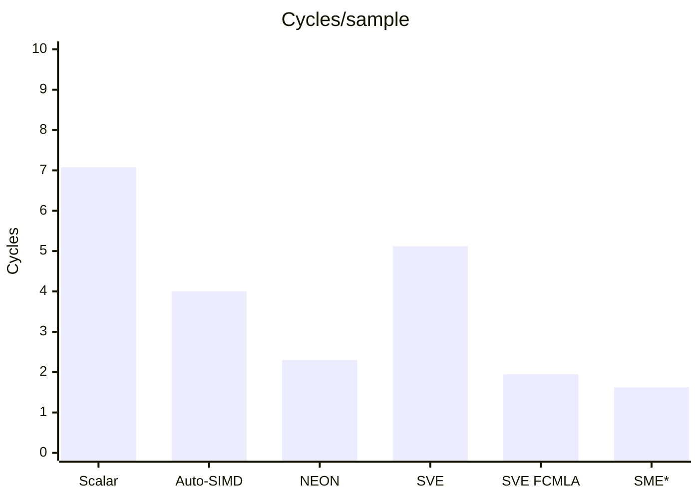

# ARM Pipeline Exploration on Toy Example

Consider different ARM implementations of a 4-Rx Maximum Ratio Combining (MRC) on the CPU pipeline. Call it a kernel.

Consider Neoverse V2, modern ARMv9 core.

Consider Godbolt framework for fast prototyping. See [▶ Open the MRC benchmark in Compiler Explorer](https://godbolt.org/z/3KaaP9rKE)

Consider compilation target: AArch64 / Armv8-A.  

Consider uarchitecture model Arm Neoverse V2.

Consider compiler: Clang 23.1 (most recent available) and `-O3` optimization level, unless specified otherwise.

The present goal is to provide a genuine benchmark of the MRC implementation over the ARM uarchitecture extensions. Focus in particular on the SIMD, NEON, SVE, SME extensions.

For benchmarking purpose, consider LLVM-MCA after isolation of the relevant piece of code. Based on that, produce some top level metrics for benchmarking purpose.

## Kernel

For each complex input sample $y = \mathbf{h}^{H}\mathbf{r}$ that rewrittes $y = \sum_{k=0}^{3} h_k^* r_k$.

This is typical usecase for LTE-A MIMO receiver. This operation is performed for each RE, that could be (20MHz, FDD Transmission Scheme), 14 OFDM symbols, 1200 subcarriers per subframe (1ms), thus 16,800 MRC per ms, ~17e6 MRC per second. Definitely a candidate for massively repeated execution on a DSP.

## Methodology and Increments

To make LLVM-MCA results comparable, each benchmark processes exactly 4 complex output samples.

LLVM-MCA regions isolate the kernel:

```cpp
asm volatile("# LLVM-MCA-BEGIN mrc4_block");

// kernel

asm volatile("# LLVM-MCA-END mrc4_block");
```

Consider for reference the build arguments:

Naive Implementation aka Scalar
```text
-O3 -std=c++17 -mcpu=neoverse-v2 -fno-vectorize -fno-slp-vectorize
```

SIMD (automatically enabled by compiler)
```text
-O3 -std=c++17 -mcpu=neoverse-v2
```

Explicit NEON
```text
-O3 -std=c++17 -mcpu=neoverse-v2
```

SVE
```text
-O3 -std=c++17 -mcpu=neoverse-v2 -msve-vector-bits=128
```

SVE (FCMLA)
```text
-O3 -std=c++17 -mcpu=neoverse-v2 -msve-vector-bits=128
```

SME
```text
-O3 -std=c++17 -mcpu=neoverse-v2+sme
```

Special case for LLVM-MCA arguments:
SME
```text
-mcpu=neoverse-v2 -mattr=+sme -timeline
```

### SIMD in a Nutshell

A first attempt was made leaving the complete variable-size MRC loop. However, the compiler-generated code contained both a vectorized main loop and a scalar remainder loop. Then LLVM-MCA analyzed both paths as part of the same code region. This made direct comparison misleading: the reported instruction count, total cycles and block throughput did not represent the same amount of useful work between the scalar and SIMD implementations. The benchmark was therefore reduced to a fixed block of 4 complex samples to match the width of a 128-bit NEON vector (`4 x float32`).

### NEON in a Nutshell

NEON is a fixed-width SIMD architecture. In AArch64, a 128-bit NEON vector can process 4 `float32` values in parallel.

In this benchmark, explicit NEON vectorizes the MRC arithmetic and uses structured loads and stores (`LD2`/`ST2`) to efficiently handle the interleaved real/imaginary complex representation.

### SVE in a Nutshell

FMA (Fused Multiply-Add) computes a multiplication and an addition as a single operation: $a = a + b \times c$. It reduces the number of instructions and performs only one floating-point rounding for the combined operation.

FCMLA (Floating-point Complex Multiply-Add) performs a multiply-accumulate directly on complex values represented as interleaved real and imaginary components: $a = a + b \times c$, where `a`, `b` and `c` contain complex values.

SVE extends SIMD with a vector-length-agnostic programming model and predicated execution. The first SVE implementation (v4) separates real and imaginary components using gather/scatter operations. This demonstrates that using a more capable SIMD ISA does not automatically produce a better implementation when the data layout is poorly matched to the instructions.

v4.1 uses FCMLA to keep the complex samples in their native representation, avoiding the gather/scatter decomposition of v4. The improvement therefore comes from a better mapping of the algorithm onto the ISA, rather than from using wider vectors: SVE is restricted to 128 bits in this comparison.

### SME in a Nutshell

SMEextends SVE with streaming execution and matrix-oriented facilities such as the ZA array.

MRC is basically a complex vector operation and does not naturally map onto SME's matrix outer-product operations. v5 therefore evaluates the complex FCMLA implementation in SME streaming mode rather than forcing the
algorithm into a matrix representation.

## Top-level Results

Performance outcome
| Metric | v1 Scalar | v2 Auto-SIMD | v3 NEON | v4 SVE | v4.1 SVE FCMLA | v5 SME* |
|---|---:|---:|---:|---:|---:|---:|
| Instructions | 134 | 75 | 26 | 45 | 29 | 37* |
| Block Throughput (cycles) | 28.3 | 16.0 | 9.2 | 20.5 | 7.8 | 6.5* |
| Speedup vs Scalar | 1.00x | 1.77x | 3.08x | 1.38x | 3.63x | 4.35x* |

\* v5 uses a hypothetical Neoverse V2 + SME LLVM-MCA configuration.
The Streaming Vector Length is not established as 128 bits by this experiment, so the MCA region cannot be normalized to exactly four complex samples.
The reported 6.5-cycle Block Throughput is therefore retained as a raw LLVM-MCA result only.

## Going More into the Details (Inside the Pipeline)

LLVM-MCA timeline helps in going beyond the above averaged metrics. See v*.log and consider notations:
```text
`D`  Dispatch
`=`  Wait before Execution
`e`  Execution Slot
`E`  Execution Completion
`-`  Wait before Retirement
`R`  Retired
```

As per the timeline view, define the average wait times:
 - [0]: Executions
 - [1]: Average time spent waiting in a scheduler's queue
 - [2]: Average time spent waiting in a scheduler's queue while ready
 - [3]: Average time elapsed from WB until retire stage

Their meaning is described below.

```text
                         Scheduler Queue                    Execution       Retirement
                    <---------------------->               <-------->      <---------->
D  =  =  =  =  =  =  =  =  e  e  e  e  E  -  -  -  -  R
│  <-------- [1] -------->  │          │  <--- [3] --->  │
│                           │          │                 │
│             <--- [2] ---> │          │                 │
│             ready, but    │          │                 │
│             waiting for   │          │                 │
│             a resource    │          │                 │
│                           │          │                 │
Dispatch                 Execute      WB              Retire
```

Basically the most interesting metric is [2] and should be minimized.


Let's build on top some timeline metrics to produce custom descriptive values derived from the LLVM-MCA timeline pipeline. Consider e.g.:
- Cycles per processed sample 
- Pipeline Usage Efficiency (PUE) $[0] / ([0]+[1])$
- Execution Density (ED) $[0] / ([0]+[1]+[3])$

The metrics are produced by `metrics.py` and fed by the logs.

Pipeline outcome
| Metric | v1 Scalar | v2 Auto-SIMD | v3 NEON | v4 SVE | v4.1 SVE FCMLA | v5 SME* |
|---|---:|---:|---:|---:|---:|---:|
| [1] Scheduler wait | 5.1 | 9.3 | 9.6 | 6.6 | 6.3 | 6.7* |
| [2] Ready/resource wait | 0.5 | 1.6 | 0.6 | 1.6 | 0.3 | 0.6* |
| [3] WB → Retire | 4.4 | 6.2 | 5.5 | 5.1 | 6.2 | 8.1* |
| Cycles/sample | 7.08 | 4.00 | 2.30 | 5.12 | 1.95 | 1.62* |
| PUE | 0.6 | 0.7 | 0.8 | 0.7 | 0.8 | 0.8* |
| ED | 3.09 | 2.18 | 1.59 | 0.69 | 1.77 | 3.69* |

Find a top-level evidence of the extensions benefit. PUE states the pipeline efficiency, cycles/sample whether it translates to actual throughput.





### Sparse yet Detailed Pipeline Comparison: Scalar (v1) vs Auto-SIMD (v2)

Interestingly, the auto-vectorized implementation is much faster overall, but shows a higher proportion of pre-execution waiting. That suggests some optimization question.

Highlight some LLVM-MCA timeline for discussion.

#### 1. Loads: Same Latency, More Data

Scalar
```asm
DeeeeeeE-----------R  ldp s1, s2, [x0]
```

Auto-SIMD
```asm
DeeeeeeE---------------R  ldp q3, q4, [x0]
```

Yet same execution latency (6 cycles), v2 deals has some retirement penalty but deals with 128-bit vector registers, that is 4x more data per instruction. There is an increase in parallelism with no significant penalty in instruction latency.

#### 2. Scalar Dependencies

Typical sequence v1:

```asm
D====eeeE-------R  fmul  s25, s2, s18
D======eeeeE----R  fmadd s25, s17, s1, s25
D======eeeE-----R  fnmul s1, s1, s18
D=======eeeeE---R  fmadd s1, s17, s2, s1
 D====eeeE------R  fnmul s2, s3, s20
 D=====eeeeE----R  fmadd s2, s19, s4, s2
 D=========eeE--R  fadd  s25, s25, s0
 D==========eeE-R  fadd  s0, s1, s0
```

`=` cycles increase along the sequence and show the instructions getting properly dispatched but stuck waiting for execution. Successive MAC and ADD operations introduce dependencies, which clip parallel processing.

#### 3. SIMD computation introduces data rearrangement

v2 processes 4 `FP32` within 1 instruction, 4 bytes each so 16 bytes (128 bits):

```asm
D=====eeE------------R  trn2  v2.4s, v0.4s, v0.4s
D======eeE-----------R  trn1  v0.4s, v0.4s, v0.4s
...
   D========eeeE-----R  fmul  v2.4s, v2.4s, v5.4s
   D=========eeeeE---R  fmla  v2.4s, v3.4s, v0.4s
```

The `.4s` vector operations perform 4 FP operations in a single operation (parallel), excellent. But see `trn1` / `trn2` that rearrange the interleaved real and imaginary components, this is a penalty prequisite enabled by SIMD when dealing with `struct Complex { float re;  float im; };`. In memory, the array of data is then interleaved `re0 im0 | re1 im1 | ...` and the compiler thinks it is mandatory to de-interleave. Well, this could be handled differently to save this cost by preparing the data with proper layout or considering `re` and `im` are independent so their order does not matter. This later aspect is a special case and does not scale up.

#### 4. SIMD Keeps Some Dependencies

Remaining limitation in v2.

```asm
D===========eeeE-----R      fmul  v1.4s, v1.4s, v3.4s
 D===========eeeeE---R      fmla  v1.4s, v21.4s, v3.4s
 D==================eeER.   fadd  v0.4s, v0.4s, v1.4s
 D====================eeER  stp   q2, q0, [x8]
```

The SIMD implementation performs data processing per instruction, but long pre-execution waits remain visible. This is visible in the final accumulation and store are still stuck, waiting for preceding results to be finished.

### Sparse yet Detailed Pipeline Comparison: Auto-SIMD (v2) vs NEON (v3)
#### 1. Data Rearrangement Overhead

Still the SIMD requires a preprocessing overhead.

```asm
DeeeeeeeeER                        ld2   { v0.4s, v1.4s }, [x0]
 DeeeeeeeeER                       ld2   { v16.4s, v17.4s }, [x4]
 D========eeeER                    fmul  v24.4s, v0.4s, v16.4s
 D=========eeeeER                  fmla  v24.4s, v1.4s, v17.4s
         D=================eeeeER  st2   { v24.4s, v25.4s }, [x8]
```

The interleaved complex layout is now replaced with NEON structured loads and stores, moving the real/imaginary separation directly to the memory access itself (no more intermediate step).

### Sparse yet Detailed Pipeline Comparison: NEON (v3) vs SVE (v4, v4.1)
#### 1. Scatter Overhead in v4

A representative sequence in v4:

```asm
D==eeeeeeeeeER         ld1w  { z2.s }, p0/z, [x2, z0.s, uxtw]
 D===eeeeeeeeeER       ld1w  { z3.s }, p0/z, [x8, z0.s, uxtw]
 DeE-----------R       add   x8, x6, #4
  D=====eeeeeeeeeER    ld1w  { z4.s }, p0/z, [x6, z0.s, uxtw]
   D======eeeeeeeeeER  ld1w  { z5.s }, p0/z, [x8, z0.s, uxtw]
```

The naive SVE in v4 implementation separates real and imaginary components through gather load operations, e.g. `z_re = [ re0 re1 re2 re3 ]`. This is required since the memory is non-continous due to our poor Complex design that does not fit well to an array representation on top. The memory rearrangement is actually more expensive than
the `ld2` / `st2` approach used by v3. This dramatically contributes to v4 regressing compared to NEON but is not really an SVE responsibility.

#### 2. Complex-Aware Arithmetic in v4.1

```asm
D=====eeeeeE-------R  fcmla z5.s, p0/m, z2.s, z0.s, #0
D=====eeeeeE-------R  fcmla z4.s, p0/m, z3.s, z1.s, #270
D=======eeeeeE-----R  fcmla z5.s, p0/m, z2.s, z0.s, #270
 D======eeeeeE-----R  fcmla z4.s, p0/m, z3.s, z1.s, #0
```

Instead of separating real and imaginary components, v4.1 keeps Complex samples in their native interleaved representation and operates directly on them using pairs of `fcmla` instructions. So the gather load penalty disappears, and even better two independent accumulators expose additional instruction-level parallelism.

With SVE still restricted to 128 bits, the block throughput eventually drops. The overall improvement actually comes from a better mapping of the algorithm onto the ISA, on top of wider vectors.

### Sparse yet Detailed Pipeline Comparison: NEON (v3) vs SME (v5)
#### 1. Vector Arithmetic remains the Limiting Structure

A representative sequence in v5:

```asm
DeeeeeeE----------------R  ldr   z0, [x0]
 DeeeeeeE---------------R  ldr   z1, [x4]
 D=eeE------------------R  mov   z4.s, #0
 DeeeeE-----------------R  ldr   x8, [sp, #2144]
 D=eeeeeeE--------------R  ld1w  { z2.s }, p0/z, [x0, x9, lsl #2]
 D=eeeeeeE--------------R  ld1w  { z3.s }, p0/z, [x4, x9, lsl #2]
 D===eeE----------------R  mov   z5.d, z4.d
  D=====eeeeeE----------R  fcmla z5.s, p0/m, z1.s, z0.s, #0
  D======eeeeeE---------R  fcmla z4.s, p0/m, z3.s, z2.s, #0
  D=======eeeeeE--------R  fcmla z5.s, p0/m, z1.s, z0.s, #270
  DeeeeeeE--------------R  ldr   z0, [x1]
  D=eeeeeeE-------------R  ldr   z1, [x5]
  D========eeeeeE-------R  fcmla z4.s, p0/m, z3.s, z2.s, #270
```
Qualitative comment, the pipeline is now in a reasonable shape, with pretty good density and fewer instructions stuck on dependencies.

Now the SME enables streaming execution, but we should ackowledge that our kernel remains fundamentally a complex vector operation. The generated code therefore still consists primarily of vector loads followed by `fcmla` dependency chains. There is no ZA matrix nor outer-product operation that naturally emerges from the kernel and the full SME capability cannot be reached in the same way as with SVE.

## Architecture outcome

| | v1 Scalar | v2 Auto-SIMD | v3 NEON | v4 SVE | v4.1 SVE FCMLA | v5 SME* |
|---|---|---|---|---|---|---|
| Data parallelism | 1 x FP32 | 4 x FP32 | 4 x FP32 | 4 x FP32 SVE | SVE complex pairs | Streaming SVE complex pairs |
| Arithmetic | Scalar FP | SIMD | NEON | SVE | SVE FCMLA | Streaming SME FCMLA |
| Data access | Scalar loads/stores | Vector loads/stores | Structured `ld2` / `st2` | Gather / scatter | Contiguous vector loads/stores | Streaming vector loads/stores |
| Data rearrangement | Minimal | `trn1` / `trn2` | Load/store deinterleaving | Gather deinterleaving | Direct interleaved complex | Direct interleaved complex |
| Main limitation | Scalar execution | Shuffle overhead | Low density pipeline | Gather overhead | FCMLA dependencies | FCMLA dependencies / model comparability |
| Block RThroughput | 28.3 | 16.0 | 9.2 | 20.5 | 7.8 | 6.5* |
| Cycles / sample | 7.08 | 4.00 | 2.30 | 5.13 | 1.95 | 1.63* |
| Relative speedup | 1.00x | 1.77x | 3.08x | 1.38x | 3.63x | 4.35x* |

\* SME extension is enabled by loading SME on the Neoverse V2 LLVM-MCA scheduling model. Since Neoverse V2 does not implement SME, then v5 is a tentative experiment in the ISS load. Then direct comparison in the benchmark is slightly speculative.

## Top-Level Outcomes based on the Benchmark

v1:   many scalar operations and dependency chains.

v2:   parallel computation and fewer instructions, but data rearrangement and remaining dependencies.

v3:   explicit NEON removes data rearrangement overhead. Some dependencies remain.

v4:   SVE vectorization, but gather/scatter overhead makes the naive mapping inefficient.

v4.1: complex-aware SVE with FCMLA removes gather overhead and reduces dependency pressure.

v5:   SME streaming further reduces modeled throughput, but the result is not directly comparable due to streaming vector length and the hypothetical V2+SME model.